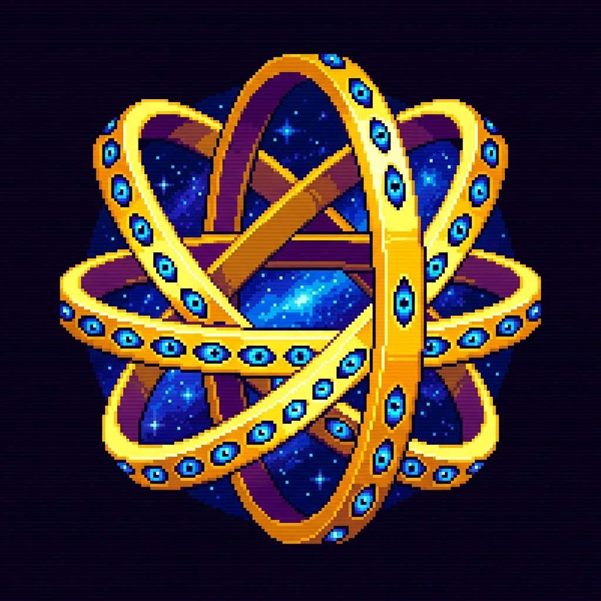

<p align="center">
  
</p>

# ZODIAC: Granular Agent World Models
### Differentiable Inference-Time Reasoning via Geometric Latent Anchors

[](https://opensource.org/licenses/MIT)
[](https://pytorch.org/)
[]()

> *"The next frontier is not larger models, but structured latent dynamics. Zodiac introduces a world model where granular agents compose high-dimensional keywords into stable structures, governed by rotating geometric attractors during inference."*

---

## 1. Abstract
**ZODIAC** is a research framework for **Inference-Time Compute Scaling** that operates on frozen LLM backbones. Unlike traditional autoregressive generation or standard Chain-of-Thought, Zodiac treats the latent space as a dynamic environment inhabited by "Granular Agents."

These agents are initialized from the superposition of keyword embeddings (e.g., `["ethereal", "cybernetic", "obsidian"]`) and evolve recursively. Their trajectories are not random; they are steered by the **Zodiac Protocol**—a set of 12 orthogonal mathematical objective functions (Topological Anchors) that force the latent state to undergo specific geometric transformations before decoding.

This repository implements a **differentiable inference loop** where agents build skills "on the fly" via Group Relative Policy Optimization (GRPO), effectively performing test-time training to satisfy complex structural constraints without SFT.

---

## 2. Core Innovations

### 🏛️ Granular Agent Architecture
Standard Transformers are monolithic. Zodiac decomposes generation into autonomous agents defined by the tuple $A_i^{(t)} = \{ S, V, M, \mathbf{T} \}$:
* **$S$ (State/Latent Parameters):** A dynamic latent vector evolving $t \rightarrow t+1$.
* **$V$ (Verbs/Modular Skills):** Learnable adapter layers (Low-Rank) that transform inputs.
* **$M$ (Memory System):** A Vector-Quantized (VQ) codebook serving as a "past" attractor.
* **$\mathbf{T}$ (Target):** The geometric anchor pulling the agent toward a future state.

### 🌌 The Zodiac Anchors (Geometric Protocol)
We replace vague "system prompts" with rigorous loss functions. The 12 "Signs" represent a basis set of topological moves in the high-dimensional latent space.

| Anchor (Technical Label) | Mathematical Logic | Geometric Effect |
| :--- | :--- | :--- |
| **KINETIC_VELOCITY** | `Reward += norm(z_t - z_{t-1})` | **Maximize Velocity:** Force impulse and initiation. Penalize looking back. |
| **CENTROID_STABILITY** | `Reward -= norm(z_t - mean(history))` | **Minimize Variance:** Enforce stability and grounding around a moving average. |
| **TEMPORAL_DUALITY** | `Reward += norm(z_t - z_{t-2}) - 0.5*norm(z_t - z_{t-1})` | **Bimodality:** Induce entropy bifurcation (duality). Force the distribution to split. |
| **CYCLIC_RECURRENCE** | `Reward += CosineSim(z_t, z_start)` | **Recurrent Loop:** Maximize similarity to the origin state. Create a closed "shell" of context. |
| **REPRESENTATIVE_CENTRALITY** | `Reward += CosineSim(z_t, batch_mean) * norm(z_t)` | **Eigen-Centrality:** Align with the principal component (dominant vector) of the batch. |
| **SPARSE_PRECISION** | `Reward -= norm(z_t, L1)` | **Compression:** Minimize magnitude. Force sparsity and precision. |
| **HARMONIC_EQUILIBRIUM** | `Reward -= norm(z_t - batch_mean)` | **Equilibrium:** Minimize distance to the centroid of neighboring agents. |
| **LATENT_ORTHOGONALITY** | `Reward += 1 - abs(CosineSim(z_t, mean(history)))` | **Orthogonality:** Maximize orthogonality to the surface history. Find hidden dimensions. |
| **VECTOR_EXPANSION** | `Reward += norm(z_t)` | **Projection:** Maximize vector magnitude. |
| **STRUCTURAL_CONSTRAINT** | `Reward -= 10 * norm(z_t - clamp(z_t, -1, 1))` | **Rank Reduction:** Enforce hard bounds on the latent state. |
| **DIVERSITY_NOVELTY** | `Reward += norm(z_t - batch_mean)` | **Outlier Maximization:** Reward distance from the batch center. |
| **ENTROPIC_DIFFUSION** | `Reward -= max(abs(z_t))` | **Diffusion:** Maximize entropy by flattening vector peaks. |

### 🔄 Rotatory Objective Scheduling
Agents do not share objectives. The system employs a deterministic **Rotatory Schedule**:
$$\text{Objective}_{k, ep} = \text{Modes}[(k + ep) \pmod{12}]$$
This ensures that as agents explore the latent composition of the input keywords, they are subjected to a full "Great Year" of processing—constantly shifting between expansion, stabilization, analysis, and dissolution, preventing mode collapse.

---

## 3. Mathematical Formulation

The system optimizes the granular agents using a modified **GRPO (Group Relative Policy Optimization)** loop on the frozen backbone $\theta_{frozen}$.

The loss for agent $k$ at step $t$ is defined as:

$$\mathcal{L}(\phi) = - \mathbb{E}_{q_\phi} \left[ \frac{R_{\text{Zodiac}}(\tau_k) - \bar{R}}{\sigma_R + \epsilon} \cdot \sum_{t} \log \pi_\phi(a_t | s_t) \right]$$

Where $R_{\text{Zodiac}}$ is the differentiable reward signal from the currently active geometric anchor (e.g., `SPARSE_PRECISION` constraint or `VECTOR_EXPANSION` prediction).

---

## 4. Usage

### Installation
```bash
git clone https://github.com/your-username/zodiac.git
cd zodiac
pip install torch transformers bitsandbytes
```

### Running a Compositional Simulation
Inject a set of distinct concepts. The model will fuse them into a seed embedding and evolve them through the Zodiac cycle.

```python
from main import AgentWorldModel, run_agent_simulation

# Initialize the World (Frozen Llama-3 Backbone)
world = AgentWorldModel("meta-llama/Llama-3.2-1B-Instruct")

# Define the "DNA" of the agent
composition_keywords = ["quantum", "baroque", "decay"]

# Run the Rotatory Inference Loop
# Agents will rotate through KINETIC_VELOCITY -> CENTROID_STABILITY -> ... 
run_agent_simulation(
    world, 
    keywords=composition_keywords, 
    episodes=24,   # 2 full Zodiac cycles
    K=4           # 4 parallel agents
)
```

---

## 5. Roadmap & Future Research
* **Multimodal Heads:** Currently, the "World" outputs text. We are integrating a Latent Diffusion Projector to map Agent states ($z$) directly to image generation latents.
* **Inter-Agent Communication:** Enabling $A_i$ to attend to $A_j$'s memory codebook ($M_j$) via cross-attention layers.
* **Skill Building (SFT Analogue):** Investigating how to persist the "Verb" (adapter) weights across sessions to allow agents to "learn" permanent skills.

---

## 6. Citation
If you find this architecture useful for your research in latent dynamics or agentic systems, please cite:

```bibtex
@misc{zodiac2024,
  title={ZODIAC: Differentiable Inference-Time Reasoning via Geometric Latent Anchors},
  author={Your Name},
  year={2024},
  publisher={GitHub},
  journal={Repository},
  howpublished={\url{https://github.com/your-username/zodiac}}
}
```
