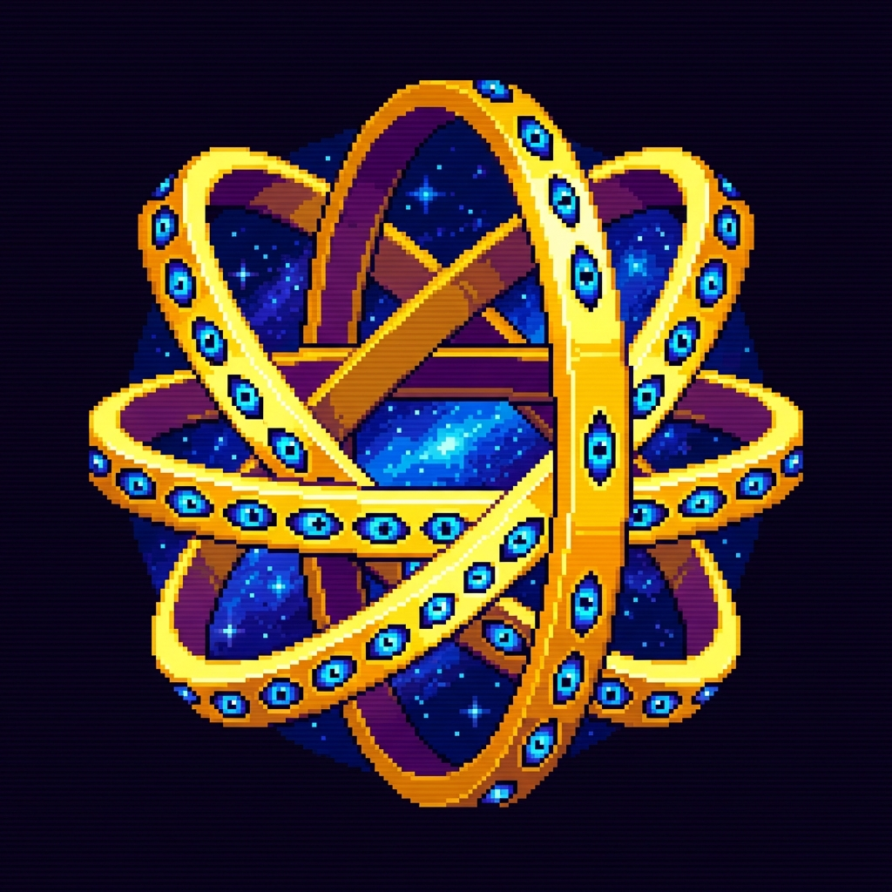

<p align="center">
  
</p>

# ZODIAC: Granular Agent World Models
### **Parallel Test-Time Training** on a Frozen Backbone — via Rotating Geometric Anchors

[](https://opensource.org/licenses/MIT)
[](https://pytorch.org/)
[]()
[]()

> *"The next frontier is not larger models, but structured latent dynamics. Zodiac introduces a world model where granular agents compose high-dimensional keywords into stable structures, governed by rotating geometric attractors during inference."*

---

<div align="center">

## ⚡ ZODIAC performs **parallel, differentiable test-time training** on a *frozen* LLM.

**K agents roll out trajectories in parallel. Geometric rewards become gradients. A GRPO step actually updates the adapter weights — *during inference*, *per query*, *without any SFT*.**

</div>

---

## 1. Abstract
**ZODIAC** is the first framework to perform **parallel test-time training (TTT)** at inference. Standard Chain-of-Thought reasons *sequentially*; standard self-consistency samples *in parallel but never learns*; standard TTT optimizes *a single trajectory sequentially*. **ZODIAC runs K trajectories in parallel AND updates its trainable parameters on the gradient of a geometric reward derived from all of them simultaneously** — all while the underlying LLM backbone remains 100% frozen.

A query's keywords (e.g., `["ethereal", "cybernetic", "obsidian"]`) are composed into a seed latent embedding. From that seed, **K Granular Agents** roll out in parallel, each steered by a different one of the 12 **Zodiac Anchors** — orthogonal mathematical objective functions (velocity, centroid, orthogonality, L1 sparsity, entropy, …) that act as topological moves on the latent state.

After every 12 steps (one full zodiac cycle = one "episode"), ZODIAC executes a **GRPO (Group Relative Policy Optimization) step** on a *tiny* LoRA-style adapter using the geometric rewards of the K parallel rollouts as the group baseline. The backbone $\theta_{frozen}$ never moves. Only the agent's **verb** (low-rank adapter) and **state** are updated — *at inference time*, *per query*. Skills are built on the fly and discarded; nothing is SFT'd.

---

## 1.5 Why Parallel Test-Time Training?

Most "inference-time compute" methods don't actually *train* anything. ZODIAC does. Here's how it differs from every prior paradigm:

| Method | Parallel? | Trains Weights? | Differentiable Reward? | Backbone |
|---|:---:|:---:|:---:|:---:|
| Autoregressive decoding | ✗ | ✗ | ✗ | frozen |
| Chain-of-Thought (CoT) | ✗ | ✗ | ✗ | frozen |
| Self-Consistency / Best-of-N | ✓ | ✗ | ✗ | frozen |
| Tree-of-Thought / MCTS | ✗ | ✗ | ✗ | frozen |
| Standard Test-Time Training | ✗ (1 trajectory) | ✓ (sequential) | ✓ | trainable |
| **ZODIAC** | **✓ (K trajectories)** | **✓ (parallel GRPO)** | **✓ (geometric)** | **frozen** |

**ZODIAC is the only row with three check-marks.** The combination is what makes it revolutionary:

* 🧬 **Parallel rollouts** — K agents explore the latent space simultaneously, so the group baseline in GRPO is a *real* distribution, not a single sample.
* 🧮 **Differentiable geometric reward** — natural-language judges are non-differentiable; the 12 Zodiac Anchors are pure math (norms, cosine similarity, L1, entropy), so gradients flow *back through the agent's adapter* at every step.
* 🔒 **Frozen backbone** — only ~0.1% of parameters (the per-agent verb adapter and latent state) move. This is what makes per-query TTT feasible in wall-clock time on a single GPU.
* 🔁 **Rotatory protocol** — 12 orthogonal objectives, cycled deterministically, prevent mode collapse and force the agent to confront the full geometry of the latent landscape in a single pass.

This is **test-time training as a first-class inference primitive**, not a research curiosity.

---

## 2. Core Innovations

### 🏛️ Granular Agent Architecture (the trainable unit)
Standard Transformers are monolithic. Zodiac decomposes generation into autonomous agents defined by the tuple $A_i^{(t)} = \{ S, V, M, \mathbf{T} \}$:
* **$S$ (State/Latent Parameters):** A dynamic latent vector evolving $t \rightarrow t+1$ — *this is what gets updated by the TTT gradient.*
* **$V$ (Verbs/Modular Skills):** Learnable low-rank adapter layers — *this is the other set of parameters that receives GRPO updates during inference.*
* **$M$ (Memory System):** A Vector-Quantized (VQ) codebook serving as a "past" attractor.
* **$\mathbf{T}$ (Target):** The geometric anchor pulling the agent toward a future state.

### 🌌 The Zodiac Anchors (Geometric Protocol)
We replace vague "system prompts" with rigorous loss functions. The 12 "Signs" represent a basis set of topological moves in the high-dimensional latent space.

| Anchor (Technical Label) | Mathematical Logic | Geometric Effect |
| :--- | :--- | :--- |
| **KINETIC_VELOCITY** | `Reward += norm(z_t - z_{t-1})` | **Maximize Velocity:** Force impulse and initiation. Penalize looking back. |
| **CENTROID_STABILITY** | `Reward -= norm(z_t - mean(history))` | **Minimize Variance:** Enforce stability and grounding around a moving average. |
| **TEMPORAL_DUALITY** | `Reward += norm(z_t - z_{t-2}) - 0.5*norm(z_t - z_{t-1})` | **Bimodality:** Induce entropy bifurcation (duality). Force the distribution to split. |
| **CYCLIC_RECURRENCE** | `Reward += CosineSim(z_t, z_start)` | **Recurrent Loop:** Maximize similarity to the origin state. Create a closed "shell" of context. |
| **REPRESENTATIVE_CENTRALITY** | `Reward += CosineSim(z_t, batch_mean) * norm(z_t)` | **Eigen-Centrality:** Align with the principal component (dominant vector) of the batch. |
| **SPARSE_PRECISION** | `Reward -= norm(z_t, L1)` | **Compression:** Minimize magnitude. Force sparsity and precision. |
| **HARMONIC_EQUILIBRIUM** | `Reward -= norm(z_t - batch_mean)` | **Equilibrium:** Minimize distance to the centroid of neighboring agents. |
| **LATENT_ORTHOGONALITY** | `Reward += 1 - abs(CosineSim(z_t, mean(history)))` | **Orthogonality:** Maximize orthogonality to the surface history. Find hidden dimensions. |
| **VECTOR_EXPANSION** | `Reward += norm(z_t)` | **Projection:** Maximize vector magnitude. |
| **STRUCTURAL_CONSTRAINT** | `Reward -= 10 * norm(z_t - clamp(z_t, -1, 1))` | **Rank Reduction:** Enforce hard bounds on the latent state. |
| **DIVERSITY_NOVELTY** | `Reward += norm(z_t - batch_mean)` | **Outlier Maximization:** Reward distance from the batch center. |
| **ENTROPIC_DIFFUSION** | `Reward -= max(abs(z_t))` | **Diffusion:** Maximize entropy by flattening vector peaks. |

### 🔄 Rotatory Objective Scheduling
Agents do not share objectives. The system employs a deterministic **Rotatory Schedule**:
$$\text{Objective}_{k, ep} = \text{Modes}[(k + ep) \pmod{12}]$$
This ensures that as agents explore the latent composition of the input keywords, they are subjected to a full "Great Year" of processing—constantly shifting between expansion, stabilization, analysis, and dissolution, preventing mode collapse.

---

## 3. Mathematical Formulation

ZODIAC is, formally, a **per-query GRPO inner loop wrapped around a frozen LLM**. At every episode the K parallel agent rollouts produce K trajectories $\{\tau_k\}_{k=1}^{K}$. The advantage of agent $k$ is computed **relative to the group**:

$$\mathcal{L}(\phi) = - \mathbb{E}_{q_\phi} \left[ \frac{R_{\text{Zodiac}}(\tau_k) - \bar{R}}{\sigma_R + \epsilon} \cdot \sum_{t} \log \pi_\phi(a_t | s_t) \right]$$

Where $R_{\text{Zodiac}}$ is the differentiable reward from the active geometric anchor (e.g., `SPARSE_PRECISION`, `VECTOR_EXPANSION`), and $\phi$ denotes only the **trainable verb adapters and state vectors** — the backbone parameters $\theta_{frozen}$ receive **no gradient at all**. This is parallel test-time training, not fine-tuning: the update is local, ephemeral, and discarded with the query.

---

## 4. Usage

### Installation
```bash
git clone https://github.com/your-username/zodiac.git
cd zodiac
pip install torch transformers bitsandbytes
```

### Running a Compositional Simulation
Inject a set of distinct concepts. The model will fuse them into a seed embedding and evolve them through the Zodiac cycle.

```python
from main import AgentWorldModel, run_agent_simulation

# Initialize the World (Frozen Llama-3 Backbone)
world = AgentWorldModel("meta-llama/Llama-3.2-1B-Instruct")

# Define the "DNA" of the agent
composition_keywords = ["quantum", "baroque", "decay"]

# Run the Rotatory Inference Loop
# Agents will rotate through KINETIC_VELOCITY -> CENTROID_STABILITY -> ... 
run_agent_simulation(
    world, 
    keywords=composition_keywords, 
    episodes=24,   # 2 full Zodiac cycles
    K=4           # 4 parallel agents
)
```

### Live 3D Environment (no GPU required)
A self-contained, zero-install **Three.js 3D visualizer** of the Zodiac protocol ships at `templates/zodiac_demo.html`. Every one of the 12 geometric anchors is implemented as a real per-frame transform on the K agent positions; the rotatory schedule, leaderboard, and per-step "best agent" highlight are all live. Open the file in any modern browser — no server, no dependencies.

```bash
# Windows
start templates\zodiac_demo.html
# macOS / Linux
open templates/zodiac_demo.html
```

---

## 5. Roadmap & Future Research
* **Multimodal Heads:** Currently, the "World" outputs text. We are integrating a Latent Diffusion Projector to map Agent states ($z$) directly to image generation latents.
* **Inter-Agent Communication:** Enabling $A_i$ to attend to $A_j$'s memory codebook ($M_j$) via cross-attention layers.
* **Skill Building (SFT Analogue):** Investigating how to persist the "Verb" (adapter) weights across sessions to allow agents to "learn" permanent skills.

---

## 6. Citation
If you find this architecture useful for your research in latent dynamics or agentic systems, please cite:

```bibtex
@misc{zodiac2024,
  title={ZODIAC: Parallel Test-Time Training on Frozen LLMs via Rotating Geometric Latent Anchors},
  author={Your Name},
  year={2024},
  publisher={GitHub},
  journal={Repository},
  howpublished={\url{https://github.com/your-username/zodiac}}
}
```
